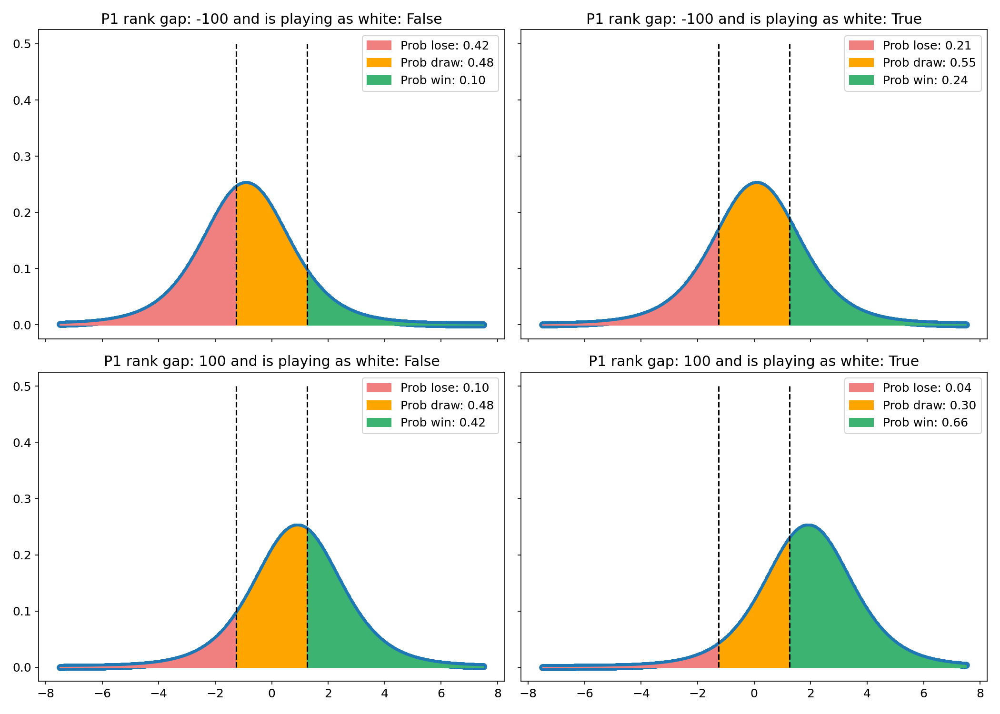

<h2 align="center">Bayesian modelling of FIDE world cup chess games</h2>

<div align="center">
  <!--Python version -->
  <a href="https://www.python.org/downloads/release/python-380/">
    
  </a>
  <!--Commits  -->
  <a href="https://github.com/maw501/bayesian-chess-prediction/commits/main">
    
  </a>
</div>
<br />

## Overview

A repository using a Bayesian hierarchical model to try to predict the outcomes of FIDE chess world cup games in 2019. The model fits an ordered logistic regression model and learns a per player ability rating.

## Getting started

Clone the repository then create the conda environment:

```
git clone git@github.com:maw501/bayesian-chess-prediction.git
cd bayesian-chess-prediction
conda env create -f environment.yml
```

In order to use the conda environment in a notebook run:

```
python -m ipykernel install --user --name=chess
```

## Notebooks

There are example notebooks outlining the problem and parts of the Bayesian workflow. 

* [`0.overview_of_problem.ipynb`](https://nbviewer.jupyter.org/github/maw501/bayesian-chess-prediction/blob/main/notebooks/0.overview_of_problem.ipynb): introduces the dataset and a simple GLM model.
* [`1.fake_data_and_prior_simulation.ipynb`](https://nbviewer.jupyter.org/github/maw501/bayesian-chess-prediction/blob/main/notebooks/1.fake_data_and_prior_simulation.ipynb): simulating fake data and fitting a model to it and prior-predictive simulation.
* [`2.fit_ordered_logistic_model.ipynb`](https://nbviewer.jupyter.org/github/maw501/bayesian-chess-prediction/blob/main/notebooks/2.fit_ordered_logistic_model.ipynb) fit a model to the dataset.
* [`3.machine_learning_baseline.ipynb`](https://nbviewer.jupyter.org/github/maw501/bayesian-chess-prediction/blob/main/notebooks/3.machine_learning_baseline.ipynb): step back and fit another machine learning model to provide a benchmark for performance.

Less finished notebooks are in the `notebooks/investigations` folder. These include fitting a simpler model that doesn't learn a per player ability rating.

## Example of assessing impact of prior values on game outcomes

